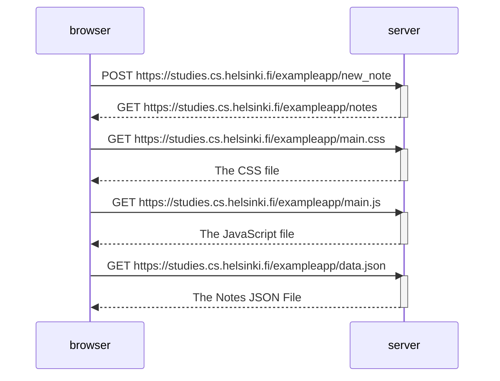

```mermaid
sequenceDiagram
participant browser
participant server

browser->>server: POST https://studies.cs.helsinki.fi/exampleapp/new_note

activate server
server-->>browser: GET https://studies.cs.helsinki.fi/exampleapp/notes
deactivate server

browser->>server: GET https://studies.cs.helsinki.fi/exampleapp/main.css
activate server
server-->>browser: The CSS file
deactivate server

browser->>server: GET https://studies.cs.helsinki.fi/exampleapp/main.js
activate server
server-->>browser: The JavaScript file
deactivate server

browser->>server: GET https://studies.cs.helsinki.fi/exampleapp/data.json
activate server
server-->>browser: The Notes JSON File
deactivate server
```
