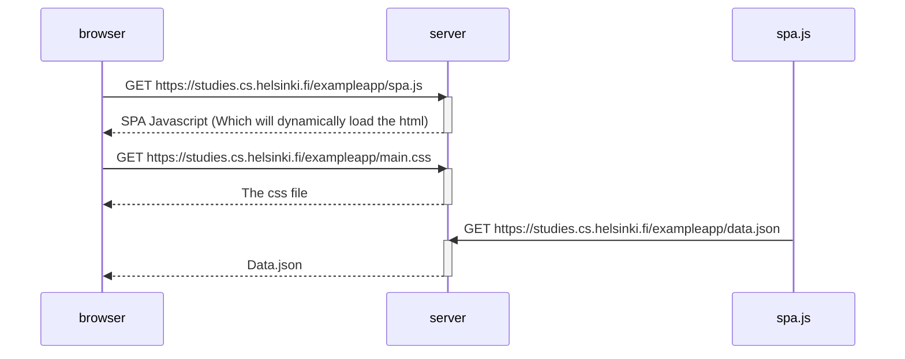

```mermaid
sequenceDiagram
    participant browser
    participant server
    participant spa.js

    browser->>server: GET https://studies.cs.helsinki.fi/exampleapp/spa.js
    activate server
    server-->>browser: SPA Javascript (Which will dynamically load the html)
    deactivate server

    browser->>server: GET https://studies.cs.helsinki.fi/exampleapp/main.css
    activate server
    server-->>browser: The css file
    deactivate server

    spa.js->>server: GET https://studies.cs.helsinki.fi/exampleapp/data.json
    activate server
    server-->>browser: Data.json
    deactivate server
```
